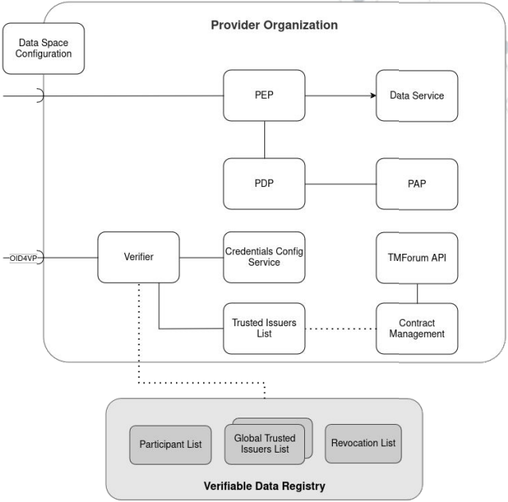
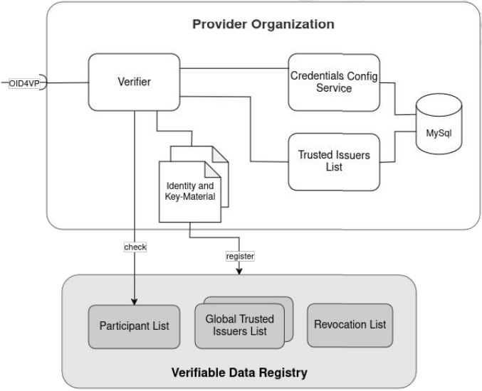
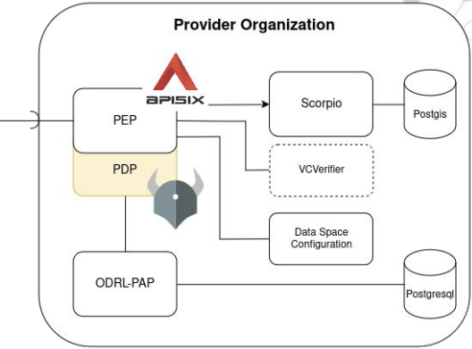
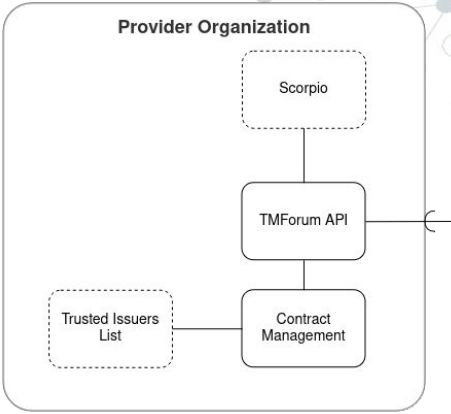

# Provider

[Return to index](../README.MD)

## Table of Contents

- [Provider](#provider)
  - [Table of Contents](#table-of-contents)
  - [Introduction](#introduction)
  - [Configuration values.yaml](#configuration-valuesyaml)
    - [Authentication](#authentication)
      - [VCVerifier](#vcverifier)
      - [Credentials Config Service](#credentials-config-service)
      - [Trusted Issuers List](#trusted-issuers-list)
      - [MySql database for TIL](#mysql-database-for-til)
    - [Authorization](#authorization)
      - [APISIX - PEP](#apisix---pep)
        - [Routes configuration](#routes-configuration)
      - [Open Policy Agent (OPA) - PDP](#open-policy-agent-opa---pdp)
      - [ODRL-PAP](#odrl-pap)
      - [Postgres database for ODRL-PAP](#postgres-database-for-odrl-pap)
      - [Scorpio - Data Service](#scorpio---data-service)
      - [Postgis database for Scorpio](#postgis-database-for-scorpio)
    - [TMForum API](#tmforum-api)
      - [TMForum APIs to support contracting](#tmforum-apis-to-support-contracting)
      - [Contract Management](#contract-management)
    - [Data Space Config](#data-space-config)
    - [Excluded services](#excluded-services)
      - [Keycloak](#keycloak)
  - [Deployment of the Provider](#deployment-of-the-provider)
    - [1. Create an identity for the provider](#1-create-an-identity-for-the-provider)
    - [2. Replace PROVIDER\_DID in values.yaml with generated DID](#2-replace-provider_did-in-valuesyaml-with-generated-did)
    - [3. Create 'provider' namespace](#3-create-provider-namespace)
    - [4. Deploy the key into the cluster](#4-deploy-the-key-into-the-cluster)
    - [5. Install the provider](#5-install-the-provider)
    - [6. Register the provider at the Trust Anchor](#6-register-the-provider-at-the-trust-anchor)
    - [7. Configure the internal Trusted Issuers List](#7-configure-the-internal-trusted-issuers-list)
    - [8. Add policies](#8-add-policies)
  - [Verify that the provider is working correctly](#verify-that-the-provider-is-working-correctly)
    - [Test unauthorized access](#test-unauthorized-access)
    - [Test authorized access](#test-authorized-access)
  - [Uninstall](#uninstall)
  - [Appendix](#appendix)
    - [Errors](#errors)
      - [Authentitation Mysql pod fails to start](#authentitation-mysql-pod-fails-to-start)
      - [ODRL-PAP pod fails to start](#odrl-pap-pod-fails-to-start)
      - [Scorpio pod fails to start](#scorpio-pod-fails-to-start)

## Introduction

Includes **authentication** and **authorization** components to manage access to the data service it offers.



**Authentication** services are registered and connected to the **Verifiable Data Registry** include:

- A **Verifiable Credential Verifier (VCVerifier)** that provides OID4VP endpoints
- A _internal_ **Trusted Issuers List** (which differs from the global one managed by the Verifiable Data Registry) and a **Credentials Config Service**, to provide information about issuers and credentials for the verifier.
- **MySql** acts as Storage Backend (can be a shared instance)

Naturally, as per the consumer, identity and key material for the organization have to be created and registered.



**Authorization** services enforce and manage policies through a combination of **Policy Enforcement Point (PEP)**, **Policy Decision Point (PDP)** and **Policy Administration Point (PAP)**. In particular:

- PEP and central entrypoint - **APISIX Gateway**: (a) routes _well-known/openid-configuration_ from the Verifier, (b) routes _well-known/data-space-configuration_ from a static fileserver and (c) checks _JWT_ at the Verifier.
- PDP - **Open Policy Agent**, which is deployed as a sidecar of APISIX for better performance.
- PAP - **ODRL-PAP** for managing policies. In this case, **Postgresql** is used as storage backend.
- Data Service - **Scorpio**: it is NGSI-LD compliant and requires **Postgis** as storage backend.



**Data marketplace and contracting** services are offered through **TMForum API** and **Contract Management**. In particular:

- **TMForum APIs** offer marketplace and contracting functionalities, and rely on a **NGSI-LD context broker** instance as a storage backend.
- Contract Management is used to integrate TMForum with the Authentication of the Data Space Connector.



Eventually, **Data Space Config** acts as well-known endpoint, and allows to configure of the data space by specifying supported data models, authentication protocols, etc.

## Configuration values.yaml

### Authentication

#### VCVerifier

```yaml
vcverifier:
  # make the verifier publicly accessible
  ingress:
    enabled: true
    hosts:
      - host: provider-verifier.127.0.0.1.nip.io
        paths:
          - "/"
  deployment:
    verifier:
      # address of the trust anchor
      tirAddress: http://tir.127.0.0.1.nip.io:8080/
      did: did:key:<PROVIDER-KEY>
    # public address of the verifier, to be provided as oid-config
    server:
      host: http://provider-verifier.127.0.0.1.nip.io:8080
    # access to the internal credentials-config-service
    configRepo:
      configEndpoint: http://credentials-config-service:8080
```

#### Credentials Config Service

```yaml
credentials-config-service:
  enabled: true
```

#### Trusted Issuers List

```yaml
# internal trusted issuers list
trusted-issuers-list:
  # only open for demo purposes
  ingress:
    til:
      enabled: true
      hosts:
        - host: til-provider.127.0.0.1.nip.io
          paths:
            - /
```

#### MySql database for TIL

```yaml
# mysql used for the credentials config service
mysql:
  primary:
    persistence:
      enabled: true      
      # use one of the classes provided by your cluster
      storageClass: local-path
```

### Authorization

#### APISIX - PEP

```yaml
# -- apisix configuration
apisix:
  dataPlane:
    # -- configure the ingress to the data service
    ingress:
      enabled: true
      hostname: mp-data-service.127.0.0.1.nip.io 
  catchAllRoute:
    enabled: false
  routes: <ROUTES>
```

Configuration of ROUTES is broken down in the following.

##### Routes configuration

Route to answer all openid-config requests to the data service from within the verifier

```yaml
- uri: /.well-known/openid-configuration
  host: mp-data-service.127.0.0.1.nip.io
  upstream:
    nodes:
      verifier:3000: 1
    type: roundrobin
  plugins:
    proxy-rewrite:
        uri: /services/data-service/.well-known/openid-configuration
```

Route to provider data-space-configuration

```yaml
- uri: /.well-known/data-space-configuration
  host: mp-data-service.127.0.0.1.nip.io
  upstream:
    nodes:
      dsconfig:3002: 1
    type: roundrobin
  plugins:
    proxy-rewrite:
      uri: /.well-known/data-space-configuration/data-space-configuration.json
    response-rewrite:
      headers:
        set:
          content-type: application/json
```

Central route to the dataservice

```yaml
- uri: /*
  host: mp-data-service.127.0.0.1.nip.io
  upstream:
    nodes:
      data-service-scorpio:9090: 1
    type: roundrobin
  plugins:
    # verify the jwt at the verifiers endpoint
    openid-connect:
      bearer_only: true
      use_jwks: true
      client_id: data-service
      client_secret: unused
      ssl_verify: false
      discovery: http://verifier:3000/services/data-service/.well-known/openid-configuration
    # request decisions at opa
    opa:
      host: "http://localhost:8181"
      policy: policy/main
      with_body: true
```

#### Open Policy Agent (OPA) - PDP

The OPA is deployed as part of the connector (in particular, as sidecar of APISIX), fulfullig the role of PDP.

```yaml
opa:
  # -- should an opa sidecar be deployed to apisix
  enabled: true
```

#### ODRL-PAP

```yaml
# policy administration point
odrl-pap:
  additonalEnvVars:
    # needs to know the providers identity to 
    - name: GENERAL_ORGANIZATION_DID
      value: did:key:<PROVIDER-KEY>
  ingress:
    enabled: true
    hosts:
      - host: pap-provider.127.0.0.1.nip.io
        paths:
          - "/"
```

#### Postgres database for ODRL-PAP

```yaml
postgresql:
  primary:
    persistence:
      enabled: true      
      # use one of the classes provided by your cluster
      storageClass: local-path
```

#### Scorpio - Data Service

```yaml
scorpio:
  enabled: true

  # configuration for the dataservice at the credentials-config-service
  ccs:
    defaultOidcScope:
      name: default
    oidcScopes:
      default:
        - type: UserCredential
          trustedParticipantsLists:
            - http://tir.trust-anchor.svc.cluster.local:8080
          trustedIssuersLists:
            - http://trusted-issuers-list:8080
      operator:
        - type: OperatorCredential
          trustedParticipantsLists:
            - http://tir.trust-anchor.svc.cluster.local:8080
          trustedIssuersLists:
            - http://trusted-issuers-list:8080
```

#### Postgis database for Scorpio

```yaml
postgis:
  primary:
    persistence:
      enabled: true      
      # use one of the classes provided by your cluster
      storageClass: local-path
```

### TMForum API

#### TMForum APIs to support contracting

```yaml
# tmforum apis to support contracting
tm-forum-api:
  ingress:
    enabled: true
    hosts:
      - host: tm-forum-api.127.0.0.1.nip.io
        paths:
          - /
```

#### Contract Management

```yaml
# contract management component and the credential type it should register for a bought service
contract-management:
  enabled: true
```

### Data Space Config

```yaml
# serves configuration of the dataspace
dataSpaceConfig:
  enabled: true
  
  ## Defaults
  serviceType: ClusterIP
  port: 3002
  supportedModels:
    - "https://raw.githubusercontent.com/smart-data-models/dataModel.Consumption/master/ConsumptionPoint/schema.json"
    - "https://raw.githubusercontent.com/smart-data-models/dataModel.Consumption/master/ConsumptionCost/schema.json"
  supportedProtocols:
    - http
    - https
  authenticationProtocols:
    - oid4vp
```

### Excluded services

#### Keycloak

Issuance of verifiable credentials is not required in this case

```yaml
keycloak:
  enabled: false
```

## Deployment of the Provider

### 1. Create an identity for the provider

1.1 Create a folder for the provider identity material

```bash
mkdir provider-identity
```

1.2 Generate the **private key** - do not get confused about the curve: openssl uses the name `prime256v1` for `secp256r1`(as defined by P-256)

```bash
openssl ecparam -name prime256v1 -genkey -noout -out provider-identity/private-key.pem
```

1.3 Generate corresponding **public key**

```bash
openssl ec -in provider-identity/private-key.pem -pubout -out provider-identity/public-key.pem
```

1.4 Create a **(self-signed) certificate**

```bash
openssl req -new -x509 -key provider-identity/private-key.pem -out provider-identity/cert.pem -days 360
```

1.5 Export the **keystore**

Tip: use `test` as keystore password.

```bash
openssl pkcs12 -export -inkey provider-identity/private-key.pem -in provider-identity/cert.pem -out provider-identity/cert.pfx -name didPrivateKey
```

1.6 Check the contents

```bash
keytool -v -keystore provider-identity/cert.pfx -list -alias didPrivateKey
```

1.7 Generate **DID** from the keystore

```bash
wget https://github.com/wistefan/did-helper/releases/download/0.1.1/did-helper

chmod +x did-helper

./did-helper -keystorePath ./provider-identity/cert.pfx -keystorePassword=test | grep -o 'did:key:.*' > provider-identity/did.key
```

### 2. Replace PROVIDER_DID in values.yaml with generated DID

### 3. Create 'provider' namespace

```bash
kubectl create namespace provider
```

### 4. Deploy the key into the cluster

```bash
kubectl create secret generic provider-identity --from-file=provider-identity/cert.pfx -n provider
```

### 5. Install the provider

```bash
helm install provider-dsc data-space-connector/data-space-connector --version 7.17.0 -f values.yaml --namespace=provider

watch kubectl get pods -n provider
```

### 6. Register the provider at the Trust Anchor

```bash
curl -X POST http://til.127.0.0.1.nip.io:8080/issuer \
--header 'Content-Type: application/json' \
--data '{
    "did": "did:key:<PROVIDER-KEY>",
    "credentials": []
}'
```

### 7. Configure the internal Trusted Issuers List

```bash
curl -X POST http://til-provider.127.0.0.1.nip.io:8080/issuer \
--header 'Content-Type: application/json' \
--data '{
  "did": "did:key:<CONSUMER-KEY>",
  "credentials": [
    {
      "credentialsType": "OperatorCredential"
    }
  ]
}'
```

### 8. Add policies

```bash
curl -s -X 'POST' http://pap-provider.127.0.0.1.nip.io:8080/policy \
-H 'Content-Type: application/json' \
-d  '{ 
        "@context": {
          "dc": "http://purl.org/dc/elements/1.1/",
          "dct": "http://purl.org/dc/terms/",
          "owl": "http://www.w3.org/2002/07/owl#",
          "odrl": "http://www.w3.org/ns/odrl/2/",
          "rdfs": "http://www.w3.org/2000/01/rdf-schema#",
          "skos": "http://www.w3.org/2004/02/skos/core#"
        },
        "@id": "https://mp-operation.org/policy/common/type",
        "@type": "odrl:Policy",
        "odrl:permission": {
          "odrl:assigner": {
            "@id": "https://www.mp-operation.org/"
          },
          "odrl:target": {
            "@type": "odrl:AssetCollection",
            "odrl:source": "urn:asset",
            "odrl:refinement": [
              {
                "@type": "odrl:Constraint",
                "odrl:leftOperand": "ngsi-ld:entityType",
                "odrl:operator": {
                  "@id": "odrl:eq"
                },
                "odrl:rightOperand": "<ENTITY-TYPE>"
              }
            ]
          },
          "odrl:assignee": {
            "@id": "vc:any"
          },
          "odrl:action": {
            "@id": "odrl:read"
          }
        }
      }'
```

ENTITY-TYPE can be any allowed entity type, such as _EnergyReport_.

## Verify that the provider is working correctly

Get data space config:

```bash
curl http://mp-data-service.127.0.0.1.nip.io:8080/.well-known/data-space-configuration
```

Get the openid-config:

```bash
curl http://mp-data-service.127.0.0.1.nip.io:8080/.well-known/openid-configuration
```

### Test unauthorized access

Check that **unauthorized access** is not allowed:

```bash
curl -s -X GET 'http://mp-data-service.127.0.0.1.nip.io:8080/ngsi-ld/v1/entities'
```

### Test authorized access

1. Prepare wallet identity (identity of the user that acts on behalf of the consumer)

    ```bash
    mkdir wallet-identity

    chmod o+rw wallet-identity

    docker run -v $(pwd)/wallet-identity:/cert quay.io/wi_stefan/did-helper:0.1.1 | grep -o 'did:key:.*' > wallet-identity/did.key

    chmod o+rw wallet-identity/private-key.pem
    ```

2. Get an access token for the consumer:

    ```bash
    export ACCESS_TOKEN=$(./scripts/get_access_token_oid4vp.sh http://mp-data-service.127.0.0.1.nip.io:8080 $USER_CREDENTIAL operator); echo $ACCESS_TOKEN
    ```

3. Access the data service:

    ```bash
    curl -s -X GET 'http://mp-data-service.127.0.0.1.nip.io:8080/ngsi-ld/v1/entities?type=EnergyReport' \
    --header 'Accept: application/json' \
    --header "Authorization: Bearer ${ACCESS_TOKEN}"
    ```

## Uninstall

```bash
helm uninstall provider-dsc -n provider
```

## Appendix

### Errors

#### Authentitation Mysql pod fails to start

Pod fails to startup with the following error:

```txt
mysqladmin: connect to server at 'localhost' failed
error: 'Access denied for user 'root'@'localhost' (using password: YES)'
```

Quick fix: delete the `data-authentication-mysql-0` pvc in `provider`'s namespace and re-deploy the provider.

1. List all pvc in namespace provider:

    ```bash
    kubectl get pvc --n provider
    ```

    (Alternatively) List all pvc

    ```bash
    kubectl get pvc --all-namespaces
    ```

2. Delete `data-authentication-mysql-0` pvc in `provider`

    ```bash
    kubectl delete pvc data-authentication-mysql-0 -n provider
    ```

3. Deploy the provider

    ```bash
    helm install provider-dsc data-space-connector/data-space-connector --version 7.17.0 -f provider/values.yaml --namespace=provider
    ```

#### ODRL-PAP pod fails to start

ODRL-PAP fails to startup with the following error:

```txt
FATAL: password authentication failed for user "postgres"
```

Quick fix: delete the `data-postgresql-0` pvc in `provider`'s namespace and re-deploy the provider.

1. List all pvc in namespace provider:

    ```bash
    kubectl get pvc --n provider
    ```

    (Alternatively) List all pvc

    ```bash
    kubectl get pvc --all-namespaces
    ```

2. Delete `data-postgresql-0` pvc in `provider`

    ```bash
    kubectl delete pvc data-postgresql-0 -n provider
    ```

3. Deploy the provider

    ```bash
    helm install provider-dsc data-space-connector/data-space-connector --version 7.17.0 -f provider/values.yaml --namespace=provider

#### Scorpio pod fails to start

Scorpio pod fails to startup with the following error:

```txt
WARN  [io.agr.pool] (agroal-11) Datasource '<default>': FATAL: password authentication failed for user "postgres"
WARN  [org.fly.cor.int.jdb.JdbcUtils] (main) Connection error: FATAL: password authentication failed for user "postgres"
```

Quick fix: delete the `data-data-service-postgis-0` pvc in `provider`'s namespace and re-deploy the provider.

1. List all pvc in namespace provider:

    ```bash
    kubectl get pvc --n provider
    ```

    (Alternatively) List all pvc

    ```bash
    kubectl get pvc --all-namespaces
    ```

2. Delete `data-data-service-postgis-0` pvc in `provider`

    ```bash
    kubectl delete pvc data-data-service-postgis-0 -n provider
    ```

3. Deploy the provider

    ```bash
    helm install provider-dsc data-space-connector/data-space-connector --version 7.17.0 -f provider/values.yaml --namespace=provider

[Return to index](../README.MD)
